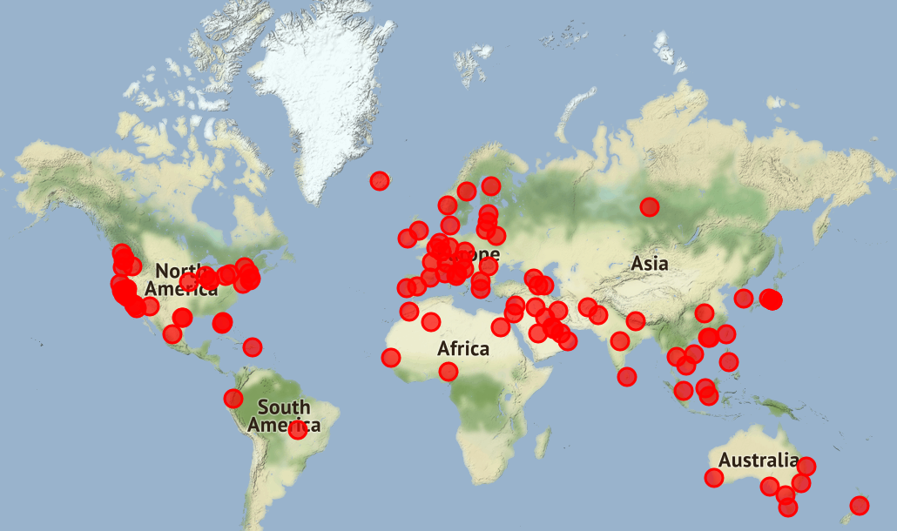

# 数据的读取及处理
本次使用的数据是Github上一个项目里的，也可以直接用pandas包导入，需要注意的是不能直接使用Github那个网址，否则会报错，需要将前面部分改成https://raw.githubusercontent.com/，然后就是加入数据的目录地址。数据主要是是三个文件，包含了疫情的确诊数（confirmed），治愈数（recoved），死亡数（deaths）。confirmed表里面包含发生疫情的国家，经纬度，以及从2020年1月22日至今的每日的确诊数；recovered表则记录了治愈数；deaths表则记录了死亡数。

```python
import numpy as np
import pandas as pd
#confirmed = pd.read_csv('https://raw.githubusercontent.com/CSSEGISandData/COVID-19/master/csse_covid_19_data/csse_covid_19_time_series/time_series_19-covid-Confirmed.csv')
#recovered = pd.read_csv('https://raw.githubusercontent.com/CSSEGISandData/COVID-19/master/csse_covid_19_data/csse_covid_19_time_series/time_series_19-covid-Recovered.csv')
#deaths =pd.read_csv('https://raw.githubusercontent.com/CSSEGISandData/COVID-19/master/csse_covid_19_data/csse_covid_19_time_series/time_series_19-covid-Deaths.csv')
confirmed = pd.read_csv('./time_series_19-covid-Confirmed.csv')
recovered = pd.read_csv('./time_series_19-covid-Recovered.csv')
deaths = pd.read_csv('./time_series_19-covid-Deaths.csv')
```
数据已经导入了，让我们来看看数据是啥样的吧。head(5)是查看数据前五行；confirmed表里面包含发生疫情的国家，经纬度，以及从2020年1月22日至今的每日的确诊数；recovered表则记录了治愈数；deaths表则记录了死亡数。

```python
confirmed.head(5)
```


```python
recovered.head(5)
```


```python
deaths.head(5)
```


```python
print(confirmed.shape)
```

```python
print(recovered.shape)
```

```python
print(deaths.shape)
```

# 数据可视化

```python
import matplotlib.pyplot as plt
plt.rcParams['font.sans-serif'] = ['SimHei']#用来正常显示中文标签
plt.rcParams['axes.unicode_minus'] = False#用来正常显示负号

countries = confirmed['Country/Region'].unique()
print(countries)#可以看出一共49个国家/地区都有新冠状肺炎病例

#计算出每日所有地区新冠肺炎的确诊数，治愈数，死亡数
```

```python
all_confirmed = np.sum(confirmed.iloc[:,4:])
all_recovered = np.sum(recovered.iloc[:,4:])
all_deaths = np.sum(deaths.iloc[:,4:])
all_confirmed

```

```python
plt.plot(all_confirmed,color = 'red',label = '确诊',marker = 'o')
plt.plot(all_recovered,color = 'blue',label = '治愈',marker = 'o')
plt.plot(all_deaths,color = 'lime',label = '死亡',marker = 'o')
plt.xticks(rotation = 45,size = 10)
```

```python
plt.yticks(size = 10)
```

```python
plt.xlabel('时间',size = 20)
plt.ylabel('数目',size = 20)
plt.title('全球疫情变化趋势',size = 30)
plt.legend(loc = 'upper left',fontsize = 20)
plt.show()
#可以看出，目前新冠肺炎确诊病例还在持续增加，不过令人高兴的是治愈数也在持续增长，死亡数很少
```


```python

#下面看看新冠肺炎的死亡率，首先计算死亡率数据，然后就可以直接画图
death_rate = (all_deaths/all_confirmed)*100
plt.plot(death_rate,color = 'lime',label = '死亡',marker = 'o')
plt.xticks(rotation = 45,size = 10)
```

```python
plt.yticks(size = 15)
```

```python
plt.xlabel('时间',size = 20)
plt.ylabel('死亡率',size = 20)
plt.title('全球疫情死亡率',size =30)
```


```python

#由于本次疫情主要发生在中国大陆，下面来具体研究下中国大陆的疫情情况，首先从全部数据中提取出中国大陆的数据。里面包含了省份，以及每个省最新的确诊数，治愈数，死亡数。
last_update = '2/28/20' #设置最新数据日期
China_cases = confirmed[['Province/State',last_update]][confirmed['Country/Region']=='Mainland China']
China_cases['recovered'] = recovered[[last_update]][recovered['Country/Region']=='Mainland China']
China_cases['deaths'] = deaths[[last_update]][deaths['Country/Region']=='Mainland China']
China_cases = China_cases.set_index('Province/State')
China_cases = China_cases.rename(columns = {last_update:'confirmed'})
China_cases
```


```python
#下面画出中国大陆每个省份的疫情数量图
Mianland_China = China_cases.sort_values(by='confirmed',ascending=True)
Mianland_China.plot(kind='barh',figsize=(20,30),color = ['red','blue','lime'],width = 1,rot = 2)
plt.title('中国大陆各省市疫情数量',size = 30)
plt.xlabel('省/市',size = 20)
plt.ylabel('数量',size = 20)
plt.xticks(size = 15)
```

```python
plt.yticks(size = 20)
```

```python
plt.legend(bbox_to_anchor = (0.95,0.95),fontsize = 20)
#可以看到，湖北省三项数据高居第一位，且远远高于其他省份。
```


```python
#下面看看中国大陆的治愈率和死亡率数据，数据使用下面的代码即可计算出来，最终结果在recover_rate和death_rate里。
confirmed_China = confirmed[confirmed['Country/Region']=='Mainland China']
confirmed_China = np.sum(confirmed_China.iloc[:,4:])
recovered_China = recovered[recovered['Country/Region']=='Mainland China']
recovered_China = np.sum(recovered_China.iloc[:,4:])
deaths_China = deaths[deaths['Country/Region']=='Mainland China']
deaths_China = np.sum(deaths_China.iloc[:,4:])
recover_rate = (recovered_China/confirmed_China)*100  #中国地区的治愈率
deaths_rate = (deaths_China/confirmed_China)*100#中国各地区的死亡率
#接下来画图
plt.plot(recover_rate,color = 'blue',label = '治愈率',marker = 'o')
plt.plot(deaths_rate,color = 'lime',label = '死亡率',marker = 'o')
plt.title('中国大陆治愈率 VS 死亡率')
plt.xlabel('时间',size = 20)
plt.ylabel('数量',size = 20)
plt.xticks(rotation = 45,size = 10)
```

```python
plt.yticks(size =15)
```

```python
plt.legend(loc = 'upper left',fontsize = 20)
#虽然在1月25日-1月31日期间死亡率略高于治愈率，但其他时间段，治愈率远远高于死亡率
```


```python
#那中国大陆其他地区这一情况咋样呢？代码大同小异，我们一起来看看，首先还是提取出其他地区的数据。
confirmed_others = confirmed[confirmed['Country/Region'] != 'Mainland China']
confirmed_others = np.sum(confirmed_others.iloc[:,4:])
recovered_others = recovered[recovered['Country/Region'] != 'Mainland China']
recovered_others = np.sum(recovered_others.iloc[:,4:])
deaths_others = deaths[deaths['Country/Region']!='Mainland China']
deaths_others = np.sum(deaths_others.iloc[:,4:])
recover_rate_others = (recovered_others/confirmed_others)*100  #其他地区的治愈率
deaths_rate_others = (deaths_others/confirmed_others)*100#其他各地区的死亡率
#接下来画图
plt.plot(recover_rate_others,color = 'blue',label = '治愈率',marker = 'o')
plt.plot(deaths_rate_others,color = 'lime',label = '死亡率',marker = 'o')
plt.title('其他地区治愈率 VS 死亡率',size = 30)
plt.xlabel('时间',size = 20)
plt.ylabel('数量',size = 20)
plt.xticks(rotation = 45,size = 10)
```

```python
plt.yticks(size =15)
```

```python
plt.legend(loc = 'upper left',fontsize = 20)
```


```python
#接下来看看其他地区疫情数量。首先还是提出其他地区的数据
others = confirmed[['Country/Region',last_update]][confirmed['Country/Region'] != 'Mainland China']
others['recovered'] = recovered[[last_update]][recovered['Country/Region'] != 'Mainland China']
others['deaths'] = deaths[[last_update]][deaths['Country/Region'] != 'Mainland China']

others_countries = others.rename(columns = {last_update:'confirmed'})
others_countries = others_countries.set_index('Country/Region')
others_countries = others_countries.groupby('Country/Region').sum()
#接着画图
others_countries.sort_values(by = 'confirmed',ascending = True).plot(kind='barh',figsize=(20,30),color = ['red','blue','lime'], width=1,rot=2)
plt.title('世界其他地区疫情数量', size=30)
plt.ylabel('Country/Region',size = 20)
plt.xlabel('数量',size = 20)
plt.yticks(size=10)
```

```python
plt.xticks(size=15)
```

```python
plt.legend(bbox_to_anchor=(0.95,0.95),fontsize = 20)
plt.show()
#从图可以看到，韩国，意大利，日本这些地区也有很多新冠肺炎患者。
```


# 绘制疫情地图
这里主要用到两个python包，一个是folium包，这个包也是笔者最近才发现的绘图包，类似于R语言绘图里的ggplot2，可以添加图层来定义一个Map对象，最后以几种方式将Map对象展现出来。这里有一个详细教程，感兴趣的可以看看https://python-visualization.github.io/folium/。另一个包就是plotly了，这也是一个强大的绘图包，详细教程请看这里https://plot.ly/python/plotly-express/。

首先是folium包绘制地图，import folium，只需要导入包就可以了，没下载这个包的记得下载才能使用。我们在前面数据里加入中国大陆的数据，并使用武汉的经纬度。

```python
import folium
others = confirmed[['Country/Region','Lat','Long',last_update]][confirmed['Country/Region'] != 'Mainland China']
others['recovered'] = recovered[[last_update]][recovered['Country/Region'] != 'Mainland China']
others['death'] = deaths[[last_update]][deaths['Country/Region'] != 'Mainland China']
others_countries = others.rename(columns = {last_update:'confirmed'})
```


```python
#然后开始正式构建地图
#定义一个world_map对象；location的格式为[纬度,经度]；zoom_start表示初始地图的缩放尺寸，数值越大放大程度越大；tiles为地图类型，用于控制绘图调用的地图样式，默认为'OpenStreetMap'，也有一些其他的内建地图样式，如'Stamen  Terrain'、'Stamen Toner'、'Mapbox Bright'、'Mapbox Control Room'等；也可以传入'None'来绘制一个没有风格的朴素地图，或传入一个URL来使用其它的自选osm。
#然后往world_map里添加其他元素，注意这里的for循环和最后的add_to是把经纬度点的信息一个一个的加进去
world_map = folium.Map(location=[10,-20],zoom_start=2.3,tiles='Stamen Toner')

for lat, lon, value, name in zip(others_countries['Lat'],others_countries['Long'],others_countries['confirmed'],others_countries['Country/Region']):
  folium.CircleMarker([lat, lon],
                              radius=10,
                              popup = ('<strong>Country</strong>: ' + str(name).capitalize()+'<br>' '<strong>Confirmed Cases</strong>: ' + str(value) + '<br>'),
                              color = "red",
                              fill_color = "red",
                              fill_opacity = 0.7).add_to(world_map)
```

```python
world_map
```


用plotly绘制每日疫情扩散地图

```python
import plotly.express as px
confirmed = confirmed.melt(id_vars = ['Province/State', 'Country/Region', 'Lat', 'Long'], var_name='date',value_name = 'confirmed')
confirmed
```


```python
#date列转换成datetime格式的数据
confirmed['date_dt'] = pd.to_datetime(confirmed.date,format='%m/%d/%y')
confirmed.date = confirmed.date_dt.dt.date
confirmed.rename(columns={'Country/Region':'country','Province/State':'province'},inplace=True)
confirmed
```


```python
#治愈数据
recovered = recovered.melt(id_vars = ['Province/State', 'Country/Region', 'Lat', 'Long'], var_name='date',value_name = 'recovered')
recovered['date_dt'] = pd.to_datetime(recovered.date, format="%m/%d/%y")
recovered.date = recovered.date_dt.dt.date
recovered.rename(columns={'Country/Region': 'country', 'Province/State': 'province'}, inplace=True)
#死亡数据
deaths = deaths.melt(id_vars = ['Province/State', 'Country/Region', 'Lat', 'Long'], var_name='date', value_name = 'deaths')
deaths['date_dt'] = pd.to_datetime(deaths.date, format="%m/%d/%y")
deaths.date = deaths.date_dt.dt.date
deaths.rename(columns={'Country/Region': 'country', 'Province/State': 'province'}, inplace=True)

merge_on = ['province', 'country', 'date']
all_data = confirmed.merge(deaths[merge_on + ['deaths']], how='left', on=merge_on).\
  merge(recovered[merge_on + ['recovered']], how='left', on=merge_on)
all_data
```


```python
Coronavirus_map = all_data.groupby(['date_dt', 'province'])['confirmed', 'deaths','recovered', 'Lat', 'Long'].max().reset_index()
Coronavirus_map['size'] = Coronavirus_map.confirmed.pow(0.5)  # 创建实心圆大小
Coronavirus_map['date_dt'] = Coronavirus_map['date_dt'].dt.strftime('%Y-%m-%d')
```


```python
fig = px.scatter_geo(Coronavirus_map, lat='Lat', lon='Long', scope='asia',
                     color="size", size='size', hover_name='province',
                     hover_data=['confirmed', 'deaths', 'recovered'],
                     projection="natural earth",animation_frame="date_dt",title='亚洲地区疫情扩散图')
fig.update(layout_coloraxis_showscale=False)
```

```python
fig.show()

```


